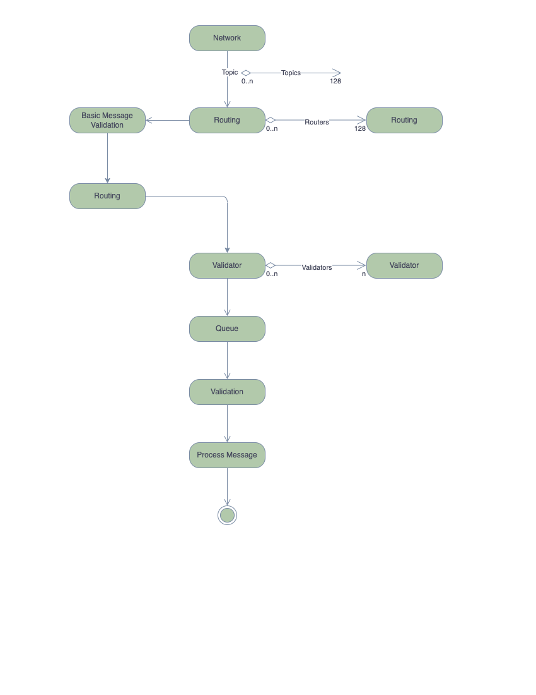

# SSV Specifications - Messaging

| Authors                                 | Status | Last Revision |
|:----------------------------------------|:-------|:--------------|
| [@niv-blox](https://github.com/nivBlox) | WIP    | MARCH 8       |

This document contains the messaging specification for `SSV.Network`.

## Overview

- [ ] [Fundamentals](#fundamentals)
  - [x] [Stack](#stack)
  - [x] [P2P Network](#p2p-networking)
  - [ ] [Validation](#validation)
    - [x] [IBFT](#ibft)
    - [ ] [Decided](#decided)
    - [ ] [Sync](#sync)
- [X] [Wire](#wire)
- [ ] [Messaging](#messages)
  - [X] [Life Cycle](#life-cycle)
  - [X] [Validator Controller](#validator-controller)
  - [X] [Validator](#validator)
  - [X] [Duty Runner](#duty-runner)
  - [ ] [QBFT Controller](#qbft-controller)
  - [ ] [Instance](#instance)
  - [ ] [Worker](#worker)
  - [ ] [Message Broker](#message-broker)
  - [ ] [Message Queue](#messages-queue)
  - [ ] [Scoring](#scoring)
## Fundamentals

### Stack

`SSV.Network` is a decentralized P2P network, consists of operator nodes grouped in multiple subnets.
The messaging layer is responsible for processing incoming messages from the network layer and broadcast it back to the network.

### P2P Networking

p2p networking works as a "black box" for the messages layer, both receiving and broadcasting messages.

### Validation
#### IBFT
Each IBFT message goes through basic validation.
- Message
  - Checks sign message is not nil
  - Checks message is not nil
- Type
  - Checks if type is expected
- Lambda
  - Checks if lambda equal to share state lambda
- Sequence Number
  - Checks if seqNum is equal to share state seqNum
- BLS
  - Get all publicKeys by the message signer id’s
  - Verify all signers are unique
  - Aggregate all pk’s
  - Deserialize message signature
  - Verify pk’s and root bytes with sig

##### Pre-Prepare
- Round
  - Validate round from state is equal to message round
- **UponPrePrepareMsg** Algorithm 2 IBFTController pseudocode for process pi: normal case operation
  upon receiving a valid ⟨PRE-PREPARE, λi, ri, value⟩ message m from leader(λi, round) such that:
  JustifyPrePrepare(m) do
  set timer i to running and expire after t(ri)
  broadcast ⟨PREPARE, λi, ri, value⟩

#### Prepare
- Round
  - Validate round from state is equal to message round
- Quorum Check

#### Commit
- Quorum Check
- Flow

   //TODO add flow diagram


#### Change Round
- Validate
  - Check if msg is nil
  - Check if Prepared value is nil
  - Check if justification message type is not `prepare`
  - Validate msg sequence number with justification msg
  - Validate msg round with justification msg
  - Validate data.prepared round with justification msg round
  - Validate msg lambda with justification msg lambda
  - Validate data prepared value with justification msg value
  - Validate enough signer id’s is not less than threshold size
  - BLS verify signature
  - **uponChangeRoundPartialQuorum**
    upon receiving a set Frc of f + 1 valid ⟨ROUND-CHANGE, λi, rj, −, −⟩ messages such that:
    ∀⟨ROUND-CHANGE, λi, rj, −, −⟩ ∈ Frc : rj > ri do
    let ⟨ROUND-CHANGE, hi, rmin, −, −⟩ ∈ Frc such that:
    ∀⟨ROUND-CHANGE, λi, rj, −, −⟩ ∈ Frc : rmin ≤ rj
    ri ← rmin
    set timer i to running and expire after t(ri)
    broadcast ⟨ROUND-CHANGE, λi, ri, pri, pvi⟩
  - Validate Round
  - **uponChangeRoundFullQuorum**
    upon receiving a quorum Qrc of valid ⟨ROUND-CHANGE, λi, ri, −, −⟩ messages such that
    leader(λi, ri) = pi ∧ JustifyRoundChange(Qrc) do
    if HighestPrepared(Qrc) ̸= ⊥ then
    let v such that (−, v) = HighestPrepared(Qrc))
    else
    let v such that v = inputValue i
    broadcast ⟨PRE-PREPARE, λi, ri, v⟩

### Decided

- Message
  - Checks sign message is not nil
  - Checks message is not nil
- Type
  - Checks if type is expected
- BLS
  - Get all publicKeys by the message signer id’s
  - Verify all signers are unique
  - Aggregate all pk’s
  - Deserialize message signature
  - Verify pk’s and root bytes with sig
- Quorum
  - Validate enough signer id’s is not less than threshold size
- Flow

   //TODO add flow diagram

### Sync

## Wire
All the messages that are being transmitted over the network must be wrapped with the following structure:

```SSVMessage
type SSVMessage struct {
	MsgType MsgType
	MsgID   MessageID
	Data    []byte
}
```
```ConsensusMsgType
type PostConsensusMessage struct {
	Height          uint64
	DutySignature   []byte // The beacon chain partial signature for a duty
	DutySigningRoot []byte // the root signed in DutySignature
	Signers         []types.OperatorID
```
```PostConsensusMsgType
type PostConsensusMessage struct {
	Height          uint64
	DutySignature   []byte // The beacon chain partial signature for a duty
	DutySigningRoot []byte // the root signed in DutySignature
	Signers         []types.OperatorID
}
```

```SyncMsgType```


## Messaging

### Life Cycle


### Validator Controller
Network interface expose "process message" function with channel. this channel serves messages.
v.c pass those messages to internal channel with buffer (128) if the buffer is full new msg's are ignored until buffer freed.
there is a go-routing that listen to this channel buffer and for each message check validator public key from the identifier and checks if exist in map.
if so, call the proper validator "processMessage" func. if not, add to queue for the [workers](#worker) to process it.

### Validator 

validator struct holds bool field "readMode". 
"processMessage" implementation - 
get msg as a parameter and checks if validator is on read mode.
if so, start validation pipeline. if not, add to queue in order to not be a blocker.
queue is handled with [message broker](#message-broker). 

### Duty Runner

Manage duty by specific type (attest, propose, sync-committee, aggregate).
Duty runner hold instance of [qbft controller](#qbft-controller).

### QBFT Controller

- Implement "processMessage" func. 
- Holds array of [instances](#instance). 

### Instance

Reaching consensus with messages getting with "processMessage" func. 

### worker

Workers work simultaneous and fetch messages from the queue and process them (process is an interface func)
in validator controller their process job is to create validator instance based on the msg pk and call "processMessage" func.

### Message Broker

Need to support more than on goroutine in order to prevent blocking other duty runners.
In order to achieve that, for each duty type we are creating a go routing that loop for specific duty type and pull the msg.
once the msg processing is done the "worker" checks if there are more msg's with the same type in the queue.
if so, keep pulling msg's. if not, close worker.

[//]: # (once worker done with process the message it's checks if more messag)

### Messages Queue
Messages can come in various times, even next round's messages can come "early" as other nodes can change round before this node.
The messages processing should be "smart & dynamic". messages will be processed by multi layer decisions
1. **Sequence number** - always priorities validator's state seqNum. until seqNum is decided no further message will be processed.
2. **Stage** - messages will be processed by time of arrival unless there are quorum of the same stage (prepare, commit). in that case processor will "push" the quorum msg's forward.
3. **Round** - Same as **Stage**, current state round have priority unless there is a quorum for a higher round.

### Scoring


